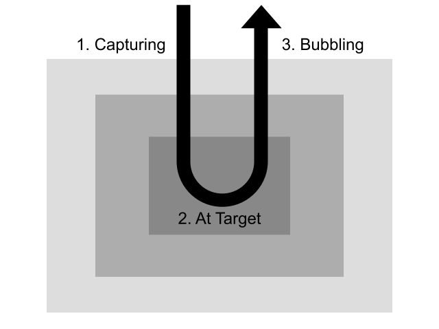

# 10/16 (화)

## 1. Today I learend

> javascript

### 1.0. 오목 게임

[오목게임 ](https://codepen.io/kimseulbi/pen/NOwJdR)

## 이벤트 객체

- `e.target` - 실제로 이벤트를 일으킨 요소
  - 이벤트 객체 정보를 보고 프로그래밍을 할 수 있다.
- `e.currentTarget` - 이벤트 전파 과정 중 현재 이벤트가 위치한 요소
- `e.stopPropagation()` - 이벤트 전파 과정을 멈추기
- `e.preventDefault()` - 이벤트가 일으키는 브라우저의 기본 동작과정을 취소하기
  이벤트는 안에 있는 요소가 있으면 계속 이벤트가 일어남
  - 여러 요소를 멈추게 할 수있다.

잘 타객팅 할때 써야함.

---

## 폼 이벤트

- `change` - checkbox, radio 등의 타입을 갖는 input 요소나 select 요소에 선택이 일어났을 때 발생
  - 다른 UI 경우는 change 사용
- `input` - text 타입을 갖는 input 요소나 textarea 요소의 값이 변경되었을 때 발생
  - text 인 경우 input
- `focus` - 키보드 포커스가 해당 요소에 옮겨졌을 때 발생
- `blur` - 키보드 포커스가 해당 요소에서 벗어났을 때 발생
- `submit` - 폼 전송이 일어났을 때 발생

<!-- https://httpbin.org/ -->

내장된 기능에서는 전송 된 정보를 json 으로 전달 한다.

<form method="post" action="https://httpbin.org/post">
// method="post" 전송 방법, 다른 방식으로 전송 및 저장위치가 다르다. 
// 전송 버튼을 누르거나 엔터를 치거나 두가지로 전송 할 수있다.
// form  안에는 내장기능이 많이 가지고 있다.

---

## 마우스 이벤트

- `click` / `dblclick` - 마우스 클릭 / 더블클릭
- `mouseover` / `mouseout` - 요소에 마우스 포인터가 들어왔을 때 / 나갔을 때
- `mousedown` / `mouseup` - 요소 위에서 마우스 버튼을 눌렀을 때 / 놓았을 때
- `mousemove` - 요소 위에서 마우스 포인터가 움직일 때마다, 자주 실행 됨

// 스타일은 자바스크립트로 하는것보다 css 에서 하는것이 좋다.
// 과제

---

## 키보드 이벤트

- `keydown` / `keyup` - 키보드 버튼을 눌렀을 때 / 놓았을 때
- `keypress` - 문자가 입력되었을 때
  //char, Key 코드는 없어질 예정

---

## 스크롤 이벤트

- `scroll` - 요소 내부의 콘텐츠가 스크롤될 때마다
  - parallax scrolling 기법 - 스크롤에 따라 배경이 변함

---

## 이벤트 전파



- 버블링이 일어나는 이벤트도 있고, 일어나지 않는 이벤트도 있음 (submit, focus, blur, change 등)
  // 특정요소 capturing, bubbing 이 일어나지 않는다.
  // capturing, bubbing 기준으로 이벤트를 실행 할것인지 정해줄 수 있다.
  // 기본적으로 bubbing 단게에서
  // 이벤트 전파는 3 단계로 나눠진다.

---

## 개인적으로 알아본 내용

### 이벤트 버블링 Event Bubbling

이벤트 버블링은 특정 화면 요소에서 이벤트가 발생했을 때 해당 이벤트가 더 상위의 화면 요소들로 전달되어 가는 특성을 의미합니다.

```
상위의 화면 요소란? HTML요소는 기본적으로 트리 구조를 갖고 여기서는 트리구조상으로 한 단계 위에 요소를를 상위 요소라고 하며 body태그를 최상위 요소라고 부름
```

**하위에서 상위 요소로의 이벤트 전파 방식을 이벤트 버블링**

### 이벤트 캡쳐 Event Capture

이벤트 캡쳐는 이벤트 버블링과 반대 방향으로 진행되는 이벤트 전파 방식입니다.
`addEventListener()` API 에서 옵션 객체에 `capture:true`를 설정해주면 됩니다. 그러면 해당 이벤트를 감지하기 위해 이벤트 버블링과 반대 방향으로 탐색합니다.

### event.stopPropagation()

해당 이벤트가 전파되는 것을 막습니다. 따라서 이벤트 버블링의 경우에는 클릭한 요소의 이벤만 발생시키고 상위 요소로 이벤트를 전달하는 것을 방해합니다. 그리고 이벤트 캡쳐의 경우에는 클릭한 요소의 최상위 요소의 이벤트만 동작시키고 하위 요소들로 이벤트를 전달하지 않습니다.

[FDS Capturing & Bubbling 실습](https://codepen.io/kimseulbi/pen/xyPKNJ)

---

## 재 복습

### 고차함수

함수를 인수로 받는 함수, 또는 함수를 반환하는 함수를 일러 고차함수
다른 함수의 인수로 너겨지는 함수를 **콜백(callback)**

### 클로저 

안쪽 스코프에서 만들어진 함수에서 바깥 스코프의 변수를 사용하고 있다면, 이 함수를 통해서 변수를 계속 사용, 심지어 바깥 스코프에 해당하는 코드의 실행이 실행이 끝난 뒤

바깥 스코프에 있는 변수를 가져다 사용하는 함수와 변수가 저장되는 저장소를 **클로저** 

## 2. Today I fonund out

## 3. 오늘 읽은 자료 (혹은 참고할 링크)

[devdocs](http://devdocs.io/dom_events/keydown)
[이벤트 버블링, 이벤트 캡처 그리고 이벤트 위임](https://joshua1988.github.io/web-development/javascript/event-propagation-delegation/)
