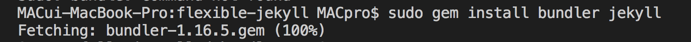
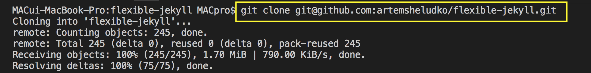
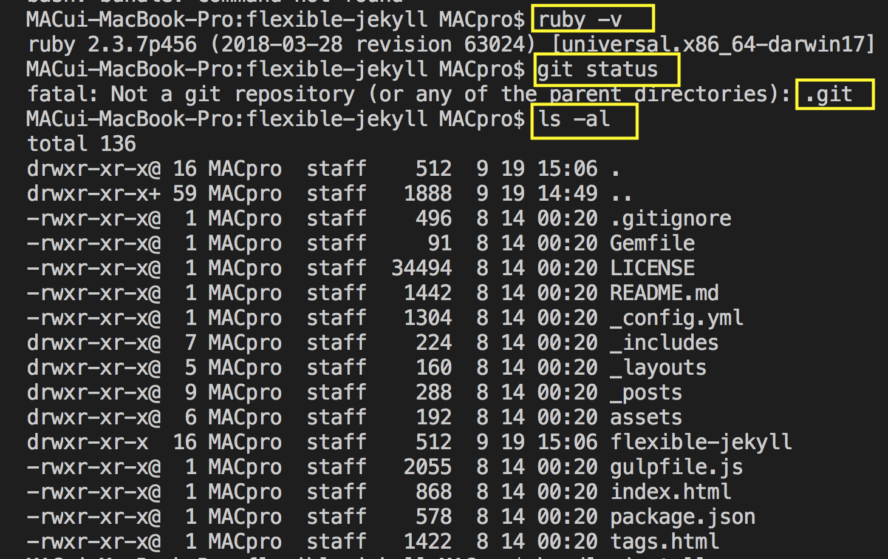
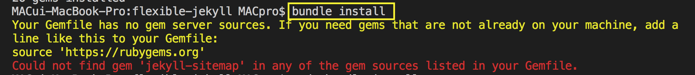
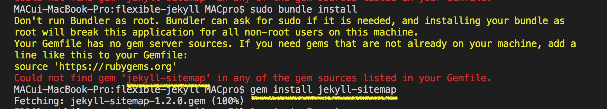
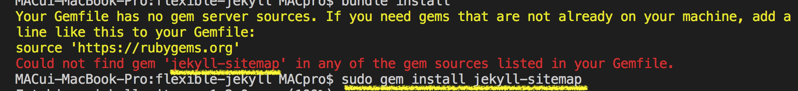
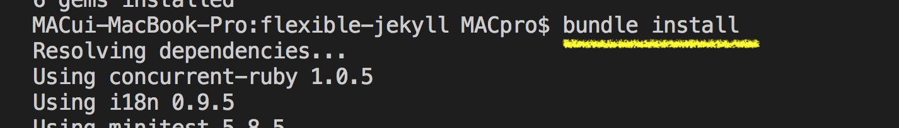

# 특강

박조은

## 정적 블로그 만들기

[Knowre](https://github.com/fds11/fds-homework/tree/master/03week)

[윈도우 지킬 설치](https://blog.psangwoo.com/coding/2017/04/02/install-jekyll-on-windows.html)

[강사님 블로그 실습 PPT](https://docs.google.com/presentation/d/1xb02T1-I8IORWRPQJPr26Yevc06Yv142APmtFNrcAvc/edit#slide=id.g428848d283_0_92)

### Jekyll가 좋은점 

- 공부한 내용을 정리하며 좀 더 잘 이해하고 기억할 수 있어요.
- 내가 정리한 글로 다른 사람에게 도움을 줄 수 있어요.
- 예전에 공부했던 게 잘 떠오르지 않을 때 내 블로그를 찾아 볼 수 있어요.
- GitHub 에 운영하면 서버 비용이 들지 않아요.
- 물론 네이버나 브랜치 같은 무료 블로그도 있지만 
  Jekyll 블로그를 운영하면 git과 github에 익숙해 지는데 도움이 됩니다.
- GA(Google Ananlytics) 같은 커스텀한 설정을 할 수 있어요.
- 포트폴리오로 사용할 수도 있어요. 

### 사전 설치

[atom](https://atom.io/)

[jekyll테마](http://jekyllthemes.org/themes/flexible-jekyll/)

### Jekyll 설치 

1. Jekyll 테마 다운로드 
1. Jekyll 폴더에서 clone
    ```
    git clone git@github.com:artemsheludko/flexible-jekyll.git
    ```
1. bundler install  
    ```
    gem install bundler 
    ```
    https://bundler.io/

1.  Jekyll 서버를 실행
    ```
    bundle install (sudo bundle install)
    bundle exec jekyll serve --watch
    ```
 *  잘 안되는 경우 및 내가 작성한 터미널 명령어 (이미지 첨부)

    
    + gem install
    
    + gitclone
    
    + clone화인 및 gemfile 확인
    
    + bundle install 
    
    + jekyll-sitemap 파일이 없다고함 개별 install
    
    + jekyll-sitemap 파일이 없다고함 개별 sudo gem install
    
    + bundle install 완료 

### 내 github 연결 
1. 기존에 설정 되어있는 git 제거 명령어 후 내 github SSH주소로 연결  
    ```
    rm -Rf .git
    git init
    git remote add  내깃헙ssh경로
    ```
1. repositories 추가  및 커밋 
    ```
    git remote add origin git@github.com:corazzon/corazzon.github.com.git
    git add .
    git commit -m ‘initial commit’
    git push -u origin master

    ```


