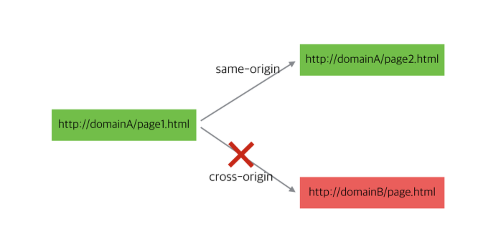
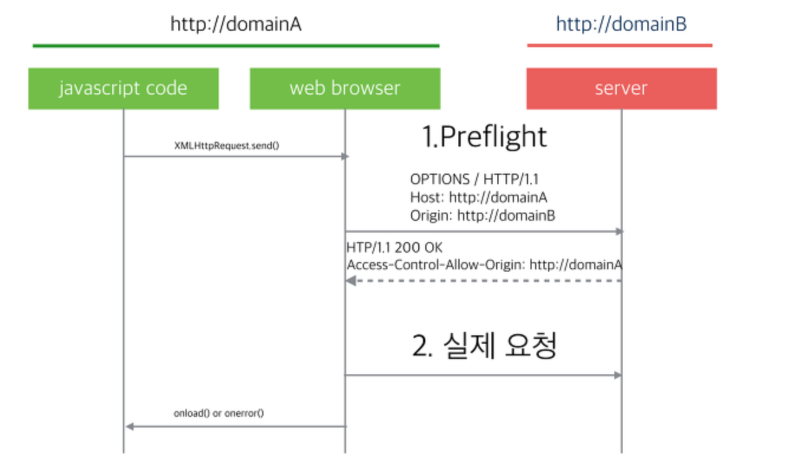
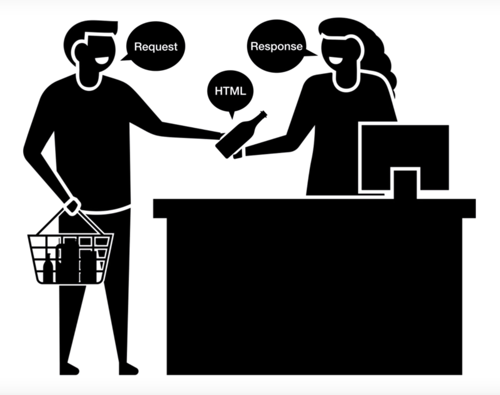

# CORS (Cross-Origin Resource Sharing)

[크로스도메인요청CORS](https://brunch.co.kr/@adrenalinee31/1)

<!-- 에이잭트대해서 배울때 단점으로  외부 서버의 경로 ajax요청을 날리면 에러가 나면서 요청 실패한다.라고 배웠잔아요. 왜 실패를 하는지 알아보겠습니다. 브라우저에서 아래와 같이 에러가 나는데요. 외부로 요청이 안되는것은 자바스크립트 엔진 표준 스펙에 동일 출처 정책이라는 보안규칙이 있기 때문입니다. -->

<!-- 동일 출처 정책은 애플리케이션 보안모델에 중요한 개념중 하나입니다.
이 정책에 의해서 자바스크립트로 다른 웹페이지에 접근할 때 같은 출처의 페이지만 접근이 가능합니다. 같은 출처라는 것은 `프로토콜`, `호스트명`, `포트`가 같다는 것을 의미합니다.
즉, 웹페이지의 스크립트는 그 페이지와 같은 서버에 있는 주소만 ajax 요청을 할 수 있다는 것입니다.

CORS에 대해서 설명하기 전에 서버의 도움 없이 동일 출처 정책을 회피하여 외부 서버로 요청을 날릴수 있는 방법 소개

우리 프로젝트 할때 이문제로 백엔드개발자에서 요청하라고 선생님이 알려주신적이 있어요.
1. 웹 브라우저 실행시 외부 요청을 허용하는 옵션을 사용
1. 외부 요청을 가능하게 해주는 플러그인 설치
1. JSONP방식으로 요청

CORS

웹 브라우저에서 외부 도메인 서버와 통신하기 위한 방식을 표준화한 스펙입니다. 서버와 클라이언트가 정해진 헤더를 통해 서로 요청이나 응답에 반응할지 결정하는 방식으로 교차 출처 지원 공유라는 이름으로 표준화가 되었습니다.


CORS 작동방식

프리플라이트 리퀘스트 (사전 요청) 요청하려는 URL이 외부 도메인일 경우 웹 브라우저는 preflight요청을 먼저 날리게 된다. preflight 요청은 실제로 요청하려는 경로와 같은 URL에 대해서 옵션 메서드로 요총을 미리 날려보고 요청을 할 수 있는 권한이 있는지 확인합니다.

이 방식으로 CORS요청을 편법 없이 하기 위해서는 클라이언트의 처리만으로 안되고 `해당 서버 측에서의 추가 처리`사항이 필요합니다.

 -->

> 외부 서버의 경로 ajax요청을 날리면 에러가 나면서 요청 실패한다. 이는 자바스크립트 엔진 표준 스펙에 동일 출처 정책이라는 보안규칙이 있기 때문입니다.

## Same-origin Policy(동일 출처 정책)

- 웹페이지에서 리소스를 불러올 때, 리소스의 출처가 웹페이지의 출처와 같으면 안전하다고 보고, 출처가 다르면 해당 리소스는 안전하지 않다고 보는 원칙
- 여기서 '출처'란 '프로토콜 + 도메인 + 포트번호'의 결합을 가리킴. 즉, 세 개가 다 같아야 동일 출처라고 할 수 있고, 셋 중에 하나라도 다르면 동일 출처로 간주되지 않음
- 웹 보안의 기본 원칙으로, 웹 브라우저의 많은 요소에 적용됨



요즘 여러 도메인에 걸쳐서 구성되는 대규모 웹 프로젝트가 늘어나고, REST API 등을 이용한 외부 호출이 많아지는 상황에서는 거추장스러운 기술이 되기도하고 있다. 그래서 만들어진 추가 정책이 CORS이다.

<!-- 렙러전테이셔널 스테이트 트랜스퍼 -->

> 🔖 REST API(Representational state transfer)\
> 월드와이드웹과 같은 분산 하이퍼미디어 시스템에서 운영되는 소프트웨어 아키텍처스타일입니다.
> https://meetup.toast.com/posts/92

### Content-Security-Policy

Content-Security-Policy 헤더를 이용하면, 동일하지 않은 출처에 대한 리소스를 불러올지 말지 결정할 수 있음
[Content-Security-Policy ](https://developers.google.com/web/fundamentals/security/csp/?hl=ko)

```
Content-Security-Policy: script-src 'self' https://apis.google.com
```

```
브라우저는 소스에 관계없이 페이지에서 요청하는 코드라면 무엇이든 다운로드하여 실행합니다.

서버에서 제공하는 모든 것 을 맹목적으로 신뢰하는 대신, CSP는 신뢰할 수 있는 콘텐츠 소스의 허용 목록을 생성할 수 있게 해주는 Content-Security-Policy HTTP 헤더를 정의하고 브라우저에는 이런 소스에서 받은 리소스만 실행하거나 렌더링할 것을 지시합니다. 공격자가 스크립트를 주입할 허점을 찾을 수도 있겠지만, 그 스크립트가 허용 목록과 일치하지 않을 것이므로 실행할 수 없을 것입니다.
```

## CORS란? (Cross-Origin Resource Sharing)

웹 브라우저에서 외부 도메인 서버와 통신하기 위한 방식을 표준화한 스펙입니다. 서버와 클라이언트가 정해진 헤더를 통해 서로 요청이나 응답에 반응할지 결정하는 방식으로 교차 출처 지원 공유라는 이름으로 표준화가 되었습니다.

- **클라이언트 측 cross-origin 요청**을 **안전하게 보낼 수 있는 방법**을 정한 표준
- **스크립트가 전혀 다른 출처를 갖는 API 서버를 사용하려고 하는 상황**에서는 뭔가 **추가적인 처리**를 해주어야한다는것.

[CORS 관련스펙](https://www.w3.org/TR/cors/#cross-origin-request-with-preflight0)

CORS 방식은 요청을 받은 웹서버가 허용할 경우에는 다른 도메인의 웹페이지 스크립트에서도 자원을 주고받을 수 있게 해줍니다.

### CORS 작동방식

**Preflight request (사전 요청)** 요청하려는 URL이 외부 도메인일 경우 웹 브라우저는 `preflight요청`을 먼저 날리게 된다. `preflight요청`은 실제로 요청하려는 경로와 같은 URL에 대해서 옵션 메서드로 요총을 미리 날려보고 요청을 할 수 있는 권한이 있는지 확인합니다.

이 방식으로 CORS요청을 편법 없이 하기 위해서는 클라이언트의 처리만으로 안되고 `해당 서버 측에서의 추가 처리`사항이 필요합니다.



### Cross-origin 요청의 위험성

1. 만약 mywebsite.com에서 서비스 중인 웹 사이트는 mywebsite.com/api 에서 REST API를 통해 필요한 정보를 얻습니다.
1. mywebsite.com/api 경로에 대한 인증은 쿠키(사용자의 정보)로 이루어지고 있습니다.

그런데 만약 evil.com 웹 사이트의 스크립트에서 mywebsite.com API에 요청을 마음대로 보낼 수 있다면, 이미 **my-website.com 도메인에 대해 브라우저에 저장된 쿠키를 이용해서 API를 마음대로 호출할 수 있을 것입니다.**

### 서버에서 CORS  요청 핸들링하기

서버로 날아온 preflight 요청을 처리하여 웹 브라우저에서 실제 요청을 날릴 수 있도록 해줍니다.

`가장 쉬운방법은` -> 모든 외부 도메인에서 모든 요청을 허용하는 방법입니다.

preflight요청을 받기 위해 옵션 메서드의 요청을 받아서 컨트롤해야 합니다. 모든 요청의 응답에 아래 header를 추가합니다.

<!-- 엑서스 컨트롤 얼러우 오리진 -->

```
Access-Control-Allow-Origin : *
```

웹 브라우저의 스크립트 엔진에서 preflight 요청 응답으로 Access-Control-Allow-Origin header에 `*`값이 있으면 모든 도메인에서의 요청을 허용하는 것으로 판단한다. ajax 요청이 실패하면서 발생하는 메시지는 바로 preflight요청을 날린 응답 메시지에 Access-Control-Allow-Origin해더가 없어서 요청이 허용되지 않는다는 뜻입니다.

### CORS에 관여하는 응답 헤더 정리

| **Request headers(클라이언트의 요청 해더)** |                                     |
| ------------------------------------------- | ----------------------------------- |
| Origin                                      | 요청을 보내는 페이지의 출처(도메인) |
| Access-Control-Request-Method               | 실제 요청하려는 메서드              |
| Access-Control-Request-Headers              | 실제 요청에 포함되어 해더 이름      |

| **Response headers(서버에서의 응답 해더)** |                                                                                                                                                                                                                           |
| ------------------------------------------ | ------------------------------------------------------------------------------------------------------------------------------------------------------------------------------------------------------------------------- |
| Access-Control-Allow-Origin                | 요청을 허용하는 출처 `*`이면 모든 곳에 공개되어 있음을 의미)                                                                                                                                                              |
| Access-Control-Allow-Credentials           | 클라이언트 요청이 쿠키를 통해서 자격 증명을 해야 하는 경우에 true. true를 응답받은 클라이언트는 실제 요청 시 서버에서 정의된 규격의 인증값이 담긴 쿠키를 같이 보내야 한다.                                                |
| Access-Control-Expose-Headers              | 클라이언트 요청에 포함되어도 되는 사용자 정의 해더                                                                                                                                                                        |
| Access-Control-Max-Age                     | 클라이언트에서 preflight의 요청 결과를 저장할 기간을 지정. 클라이언트에서 preflight 요청의 결과를 저장하고 있을 시간이다. 해당 시간 동안은 preflight요청을 다시 하지 않게 된다.                                           |
| Access-Control-Allow-Methods               | 요청을 허용하는 매서드. 기본값은 GET, POST라고 보면 된다. 이 해더가 없으면 GET과 POST 요청만 가능하다. 만약 이 해더가 지정이 되어 있으면, 클라이언트에서는 해더값에 해당하는 메서드일 경우에만 실제 요청을 시도하게 된다. |
| Access-Control-Allow-Headers               | 요청을 허용하는 매서드.                                                                                                                                                                                                   |

## 결론적으로

### 서버

1. 서버가 이 스펙을 지원한다고 해서 다른 보안정책을 마련하지 않으면 안된다.
1. 일반적인 웹 브라우저에서 스크립트에 의한 Ajax 요청만 적용을 받을 수있다고 생각해야된다.
1. open API 같은 것을 개발중리아면 클라이언트가 각종 편법들을 동원해서 서버에 접근하지 않아도 되도록 CORS요청을 핸들링 해줘야한다.

### 클라이언트

1. **개발자가 데스트 혹은 개발단계에서 쉽게 요청하기**: 웹 브라우저 실행 옵션이나 플로그인을 통한 CORS 회피
1. **CORS구현이 안되어 있는 서버로 ajax요청을 해야 하지만 서버 쪽 컨트롤이 불가능할 경우**: jsonp방식으로 요청
1. **Ajax요청을 해야 하는 다른 도메인의 서버를 클라이언트와 같이 개발하거나 서버 개발 쪽 수정 요청이 가능한 경우**: 서버에서 CORS 요청이 허용되도록 구현, [cors 미들웨어](https://www.npmjs.com/package/cors#simple-usage-enable-all-cors-requests)를 사용
1. 프론트엔드와 API서버를 **같은 도메인**으로 제공한다.: CORS적용 안하면 됨

# HTTP/ HTTPS


Web browser와 Web server 통신을 규칙인 HTTP/HTTPS

> **웹구성 4가지**\
> 페이지를 만드는 언어 `HTML`\
> 원하는 웹피이지에 방문할수 있도록 도와주는 주소 체계 `URL`, `URI`\
> 웹페이지를 주고 받는 소프트웨어인 `웹브라우저`, `웹서버`\
> Web browser와 Web server 통신을 규칙인 `HTTP`,`HTTPS`

## HTTP(HyperText Transfer Protocol)란?



```
고객이 클라이언트👨🏻‍💼, 캐셔가 서버👩🏻‍🌾, 물건이 http🥕
클라이언트가 요청(Request)하면 서버가 응답(Response) 합니다.
http는 Request와 Response를 나나냅니다.  HTML, CSS, JS, 이미지 등... 콘텐츠들을 클라이언트와 서버가 주고 받기 위해서 서로 알아 듣기위해서 공통의 약속이 메시지가 html입니다.
```


1. Browser (IE, Chrome, Safari, Firefox)가 web server와 통신하기 위한 규약
2. Browser에서 요청(Request)하면 응답(Response)하는 간단한 구조(프로토콜)

**`HTTP`로 통신을 한다면 암호화가 되어있지 않기 때문에 서보와 클라이언트가 서로 주고받응 메시지를 알아개내기가 쉽습니다.(보안 취약)**

## HTTPS(Hyper Text Transfer Protocol Secure)란?


**2000년 5월 HTTPS는 공식적으로 RFC 2818에 규정되었습니다.**
참고로 네이버는 2017년에 https로 변경되어답니다. 우리나라는 사용자의 보안을 고려하지 않는거죠~ 🤬

HTTPS는 브라우저와 연결된 웹 사이트간에 데이터를 전송하는 프로토콜 인 `HTTP의 보안 버전`입니다.

**HTTPS 끝의 S**는 **보안**을 나타냅니다. 그것은 귀하의 브라우저와 웹 사이틀 간의 모든 통신이 암호화되었음을 의미합니다.

웹브라우저는 주소 표시 줄에 자물쇠 아이콘을 표시하여 HTTPS 연결이 유효함을 시각적으로 나타냅니다.

HTTPS와 SSL를 같은 의미로 이해하지만. 이것은 맞기도 틀리기도 하다. 그것은 마치 인터넷과 웹을 같은 의미로 이해하는 것과 같다. 결론적으로 말하면 웹이 인터넷 위에서 돌아가는 서비스 중의 하나인 것처럼 HTTPS도 SSL 프로토콜 위에서 돌아가는 프로토콜이다.

### HTTPS는 어떻게 작동할까요?


### SSL 디지털 인증서

- 클라이언트와 서버간의 통신을 공인된 제3자업체(CA)가 보증해주는 전자화된 문서

> 🔖 CA (Certificate Authority)\
> 디지털 인증를 제공하는 공인 기업


- 전자서명방식이 SSL인증서 방법과 동일하다.
- 전자 서명으로 누가 메시지를 썼는지 알려주고, 메시지가 위조되지 않았음을 증명할 수 있다.
- 공개키, 비공개키는 데이터 제공자의 신원을 보장
- 비공개의 소유자가 비공개 키를 이용해 정보 암호화 -> 공개키와 함께 암호화된 정보를 전송 -> 수신자는 공개키는 암호화된 정보를 복호화
- 암호화된 데이터를 공개키를 가지고 복호화 할 수 있다는 것은 그 데이터가 공개키와 쌍을 이루는 비공개키에 의해서 암호화 되었다는 것을 의미한다.
- 공개키가 데이터를 제공한 사람의 신원을 보장해주게 되는 것이다.

### SSL 인증서의 장점 및 역할

- 통신 내용이 노출, 변경되는 것을 방지
- 클라이언트가 접속하려는 서버가 신뢰 할 수 있는 서버인지 확인가능
- SSL통신에 사용할 공개키를 클라이언트에게 제공

### SSL 동작방법

- 공개키 암호 방식은 알고리즘 계산방식이 느린 경향이 있다.
- 따라서 SSL은 암호화된 데이터를 전송하기 위해서 공개키와 대칭키 암호화 방식을 혼합하여 사용한다.
- 안전한 의사소통 채널을 수립할 때는 공개키 암호를 사용하고, 이렇게 만들어진 안전한 채널을 통해서 임시의 무작위 대칭키를 생성 및 교환한다. 해당 대칭키는 나머지 데이터 암호화에 활용한다.
  - 실제 데이터 암호화 방식 : 대칭키
  - 상기 대칭키를 서로 공유하기 위한 암호화 방식 : 공개키

### SSL 통신방법


[생활코딩 HTTPS와 SSL 인증서 심화(서버) 알고 싶다면](https://opentutorials.org/course/228/4894)

## 🌟HTTPS가 HTTP보다 나은점

**1. HTTPS는 HTTP보다 빠르다** ︎︎✔︎


[확인해볼까요???? 누가 빠르나?](http://www.httpvshttps.com/)

**2. 구글 노출 랭킹에 도움이 된다.** ✔︎  


**3. ATS(IOS App Transport Secutiry)는 HTTP를 차단**


**4. PWA(Progressive Web Apps)에는 https만 가능**

<!-- 프로그레시브 웹 앱 -->

> PWA(Progressive Web Apps)\
> 웹의 장점과 앱의 장점을 결합한 환경입니다 웹앱인거 같음.


**5. 지리정보, 자동기입 등의 모든 API는 https가 필요함**


**6. https는 도입비용이 비싸지 않음**

> 타브리즈 디렉터는 "`인증 비용`을 `무료`로 해주는 업체들이 늘었고 `성능 저하도 거의 없다`" 설치가 조금 복잡하더라도 그건 이용자들의 보안을 위해서라면 기업들이 최소한으로 해야 할 것"이라고 강조했다.


**7. 안전하다.**


### HTTPS 파일을 HTTP로 서빙

[HTTPS는 HTTP보다 빠르다 (다시 읽어보기)](https://tech.ssut.me/https-is-faster-than-http/)

# HTTP Cache

## Cache 만들어진 배경

웹이 만들어진 이후에 많은 삶이 달라지면서 사람은 욕심은 증가했습니다. 데이터가 급증하여 데이터의 속도를 증가 시키기위해서 생겨났습니다.

## Cache란?

돈이 아니라 저장한다는 의미입니다.

한번 다운로드받은 파일을 다시 받지 않고 컴퓨터에 저장 즉 캐시 했다가 같은 주소로 접속한다면 캐시해둔 파일을 사용한다면 네트워크 지연으로 인한 속도저하를 막을수 있는 방법입니다.

- 자원의 효율적 로딩을 위한 웹 표준
- 서버에서 가져온 자원(HTML, CSS, JS, 이미지, ...)을 가까운 곳(브라우저, 혹은 다른 서버)에 저장해놓고 재사용
- 캐시를 할 것인지 말 것인지, 어떻게 할 것인지를 결정하는 규칙이 복잡하고, 브라우저마다 조금씩 다름

> **Cache의 안타까움**\
> 캐시를 최신상태를 유지하는 방법이 어렵습니다....
> 내용이 갱신되었을때도 그사실을 웹브라우저라면 알지 못합니다.

## 캐시 제어 방법

```
* 웹브라우저 캐시 비우기(갱신)*
Windows: Ctrl + F5
MacOS: Cmd + R
Linux: F5
```

일반 사용자를 위해 만들어진것들을 소개 하겠습니다.

### Cache 관련 헤더

사실 어떻게 cache 헤더를 적용하는지 모르겠지만.... 서버에서 하는거 같아요.... 아파치동작을 설정하는 conf파일에 캐시설정을 하더라구요...넣더라구요...

**Cache-Control**
(요청, 응답) 캐시와 관련된 다양한 기능을 하는 지시자를 포함. no-cache, max-age가 많이 사용됨. no-cache, max-age=0 지시자는 캐시를 사용하지 않도록 하거나, 캐시를 아직도 쓸 수 있는지 검증하기 위해 사용됨 (각각의 자세한 의미)

**ETag**
(응답) 캐시의 검증을 위해 사용되는 자원의 식별자. 주로 자원의 해시값이 사용되나, 마지막으로 수정된 시각, 혹은 버전 넘버를 사용하기도 함

**Expires**
(응답) 캐시를 만료시킬 시각을 서버에서 명시적으로 지정

**Last-Modified**
(응답) 원래 자료가 마지막으로 수정된 시각

**If-None-Match**
(요청) 검증을 위해 사용됨. 이전에 저장해두었던 자원의 ETag 값을 If-None-Match 헤더의 값으로 요청에 포함시켜서 보내면, 서버는 해당 경로에 있는 자원의 ETag와 비교해보고 자원의 전송 여부를 결정

**If-Modified-Since**
(요청) 검증을 위해 사용됨. 이전에 저장해두었던 자원의 Last-Modified 값을 If-Modified-Since 헤더의 값으로 요청에 포함시켜서 보내면, 서버는 해당 경로에 있는 자원의 Last-Modified와 비교해보고 자원의 전송 여부를 결정

### 캐시적용

- 브라우저는 이미 캐시를 잘 활용하도록 만들어져 있습니다.
- Express는 이미 캐시를 잘 활용하도록 만들어져 있습니다.
- Netlify는 이미 캐시를 잘 활용하도록 만들어져 있습니다.
- 오예!!!!!!!!!!!!!!!!!

일단은 별다른 추가작업 없이도 편하게 캐시 기능을 사용할 수 있지만, 우리가 원하는대로 캐시가 동작하지 않을 때 그 원인을 파악하기 위해 캐시 관련 헤더는 숙지해두는 것이 좋습니다. 그리고 HTTP method를 용도에 맞게 사용하는 것도 중요합니다.

[No-Cache방법](https://support.microsoft.com/ko-kr/help/234067/how-to-prevent-caching-in-internet-explorer)

### 캐쉬정책(영상으로 설명을 대신합니다.)

[](https://www.youtube.com/embed/kmdQlpIQTdE)

[생활코딩 httpCache 강의(나는 적용하는것도 알고 싶다!!!)](https://opentutorials.org/module/3830/22985)

# 🎉 (추가) 개발자가 꼭 알아야 할 보안

- 다 같이 읽어보아요!!! -> [개발자가 꼭 알아야 할 보안이야기](https://www.slideshare.net/deview/d2-campus-seminar-45210063?fbclid=IwAR0hFi9I4-WqdI8RntdBl1StI0hcgMWv85dAHbHkmmrSPW1YfDLfCQkznN0)

- 활용해 보아요.📝\
  [개발자가 알아할 보안리스트](https://github.com/FallibleInc/security-guide-for-developers/blob/master/security-checklist.md)

# 참고할 링크

[seopressor](https://seopressor.com/blog/http-vs-https/)

[https 좋은점](https://developers.google.com/web/fundamentals/security/encrypt-in-transit/why-https?hl=ko)

[wayhome25](https://wayhome25.github.io/cs/2018/03/11/ssl-https/)

# 면접 문제

1. CORS에 대해 설명할 수 있나?
1. (선택사항🐶) http 프로토콜에서 https이미지를 불러올 수 있나? 불러온다면 어떠한 문제가 있을까. warning을 없앨 수 있는 방법은 무엇일까?
