#클래스

## 1. ES2015 class

ES2015 이전까지는 비슷한 종류 객체를 많이 만들어내기 위해 **생성자**를 사용해왔습니다.

ES2015에서 도입된 **클래스**는 생성자의 기능을 대체합니다. `class` 표현식을 사용하면, 생성자와 같은 기능을 하는 함수를 훨씬 더 깔끔한 문법으로 정의할 수 있습니다.

메서드에 `constructor`라는 이름을 붙이면 이 메서드는 해당 클래스의 생성자 함수 역활을 합니다.

```js
// 클래스
class Person {
  // 이전에서 사용하던 생성자 함수는 클래스 안에 `cosntructor`라는 이름으로 정의합니다.
  constructor({ name, age }) {
    this.name = name;
    this.age = age;
  }

  // 객체에서 메소드를 정의할 때 사용하던 문법을 그대로 사용하면, 메소드가 자동으로 `Person.prototype`에 저장됩니다.
  introduce() {
    return `안녕하세요, 제 이름은 ${this.name}입니다.`;
  }
}

const person = new Person({ name: "윤아준", age: 19 });
console.log(person.introduce()); // 안녕하세요, 제 이름은 윤아준입니다.
```

`class` 블록에서는 JavaScript의 다른 곳에서는 사용되지 않는 별도의 문법으로 코드를 작성해야합니다. 함수 혹은 객체의 내부에서 사용하는 문법과 혼동하지 않도록 주의하세요.

```js
// 클래스는 함수가 아닙니다!
class Person {
  console.log('hello');
}
// 에러: Unexpected token
```

```js
// 클래스는 객체가 아닙니다!
class Person {
  prop1: 1,
  prop2: 2
}
// 에러: Unexpected token
```

문법이 아니라 동작방식의 측면에서 보면, ES2015 이전의 생성자와 ES2015의 클래스는 다음과 같은 차이점이 있습니다.

- 클래스는 **함수로 호출될 수 없습니다.**
- 클래스 선언은 `let`과 `const`처럼 **블록 스코프**에 선언되면, **호이스팅(hosting)**이 일어나지 않습니다.
- 클래스의 메소드 안에서 `super`키워드를 사용할 수 있습니다

---

🔖 블록 스코프
중괄호({})내부에서 `const` 또는 `let`으로 변수를 선언하면, 그 변수들은 중괄호 블록 내부에서만 접근할수 있습니다.

🔖 호이스팅(hosting)
`var`로 선언된 변수는 내부적으로 함수 혹은 파일의 맨 위로 끌어올려지는 과정을 거치기 때문에, 같은 스코프 안에만 있다면 변수가 선언되기 전에도 해당 변수에 접근할 있는 현상

---

## 2. 메소드 정의하기

클래스의 메소드를 정의할 때는 객체 리터럴에서 사용하던 문법과 유사한 문법을 사용합니다.

인스턴스 메소드는 다음과 같은 문법을 통해 정의합니다.

```js
class Calculator {
  add(x, y) {
    return x + y;
  }
  subtract(x, y) {
    return x - y;
  }
}
```

---

🔖 객체 리터럴
객체는 한꺼번에 여러 값을 담을 수 있는 통과 같은 자료구조입니다. 객체 안에서 이름-값 쌍이 저장되는데, 이를 객체의 속성이라고 합니다.

```js
const person = {
  name: "윤아준", // 속성 이름 - 'name', 속성 값 - '윤아준'
  age: 19, // 속성 이름 - 'age', 속성 값 - 19
  languages: ["Korean", "English"], // 속성 이름 - 'languages', 속성 값 - 배열
  "한국 나이": 20 // 속성 이름 - '한국 나이', 속성 값 - 20
};
```

🔖 인스턴스 (Instance)
생성자를 통해 생성된 객체를 그 생성자의 인스턴스(instance)라고 합니다.

```js
// 생성자 정의
function Person(name) {
  this.name = name;
}

// 생성자를 통한 객체 생성
// person1이 Person의 인스턴스입니다.
const person1 = new Person("윤아준");
```

🔖 메소드(method)
어떤 객체의 속성으로 접근해서 사용하는 함수를 메소드(method)

```js
const person = {
  greet: function() {
    return "hello";
  }
};

person.greet(); // 'hello';
```

---

객체 리터럴의 문법과 마찬가지로, 임의 표현식을 **대괄호**로 둘러싸서 메소드의 이름으로 사용할수도 있습니다.

```js
const methodName = 'introduce';
class Person {
    constructor({name, age}) {
        this.name = name;
        this.age = age;
    }
    // 아래 메소드의 이름은 `introduce`가 됩니다.
    [methodName]{
        return `안녕하세요, 제 이름은 ${this.name}입니다.`;
    }
}
console.log(new Person({name: '윤아준', age: 19}).introduce()); // 안녕하세요, 제 이름은 윤아준입니다.
```

**Getter** 혹은 **Setter**를 정의하고 싶을 때는 메소드 이름 앞에 `get` 또는 `set`을 붙여주면 됩니다.

```js
class Account {
  constructor() {
    this._balance = 0;
  }
  // get 읽기
  get balance() {
    return this._balance;
  }
  // set 변경
  set balance(newBalance) {
    this._balance = newBalance;
  }
}

const account = new Account();
account.balance = 10000;
account.balance; // 10000
```

`static` 키워드를 메소드 이름 앞에 붙여주면 해당 메소드는 정적 메소드가 됩니다.

```js
class Person {
  constructor({ name, age }) {
    this.name = name;
    this.age = age;
  }
  // 이 메소드는 정적 메소드입니다.
  // reduce - 모든 요소의 값을 종합해서 하나의 값으로 만드는 계산 (배열)
  static sumAge(...people) {
    return people.reduce((acc, person) => acc + person.age, 0);
  }
}

const person1 = new Person({ name: "윤아준", age: 19 });
const person2 = new Person({ name: "신하경", age: 20 });

Person.sumAge(person1, person2); // 39
```

---

🔖 정적 메소드
JavaScript의 함수는 객체이기도 하다는 사실을 앞에서 언급했습니다. 생성자의 속성에 직접 지정된 메소드를 가지고 정적메소드라고 합니다.
정적 메소드는 특정 인스턴스에 대한 작업이 아니라, 해당 생성자와 관련된 일반적인 작업을 정의하고 싶을때 사용됩니다.

정적인 이유는 생성자를 직접 넣어주면 정적이라고 합니다.

그냥 메소드랑 정적 메소드는 저장장소가 다르며 this메소드를 사용 하지 않을때 사용 합니다.

```js
// 생성자의 속성에 함수를 직접 할당합니다.
Person.compareAge = function(person1, person2) {
  if (person1.age < person2.age) {
    return "첫 번째 사람의 나이가 더 많습니다.";
  } else if (person1.age === person2.age) {
    return "두 사람의 나이가 같습니다.";
  } else {
    return "두 번째 사람의 나이가 더 많습니다.";
  }
};
```

---

Generator 메소드를 정의하려면, 메소드 이름 앞에 `*` 기호를 붙여주면 됩니다.
아래와 같이 `Symbol.iterator` 메소드를 generator로 정의해주면, 클래스의 인스턴스를 쉽게 iterable로 만들 수 있습니다.

```js
class Gen {
  *[Symbol.iterator]() {
    yield 1;
    yield 2;
    yield 3;
  }
}

// 1, 2, 3이 차례대로 출력됩니다.
for (let n of new Gen()) {
  console.log(n);
}
```

## 3. 클래스 필드(Class Field)

클래스 블록 안에서 할당 연산자(=)를 이용해 인스턴스 속성을 지정할 수 있는 문법을 **클래스 필드(class field)**라고 합니다.

```js
class Counter {
  static initial = 0; // static class field
  count = Counter.initial; // class field
  inc() {
    return this.count++;
  }
}

const counter = new Counter();
console.log(counter.inc()); // 0
console.log(counter.inc()); // 1

Counter.initial = 10;
console.log(new Counter().count); // 10
```

클래스 필드는 아직 정식 표준으로 채택된 기능은 아닙니다. 아직 이 기능을 구현한 브라우저는 없는 상태이고, Babel, TypeScript 등의 트랜스파일러를 통해 일부 기능을 사용할 수 있습니다.

#### 클래스 필드와 this

`class` 블록은 새로운 블록 스코프를 형성하고, 이 내부에서 사용된 `this`는 인스턴스 객체를 가리키게 됩니다.

```js
class MyClass {
  a = 1;
  b = this.a;
}
new MyClass().b; //1
```

이 성질을 이용하면, **화살표 함수를 통해서 메소드를 정의할 수 있습니다.**

```js
class MyClass {
  a = 1;
  getA = () => {
    return this.a;
  };
}

new MyClass().getA(); // 1
```

일반적인 메소드와 동작방식 측면에서 광장히 큰 차이점이 있습니다.

1. 일반적인 메소드는 클래스의 `prototype`속성에 저장되는 반면, **클래스필드는 인스턴스 객체에 저장됩니다.**
1. 화살표 함수의 `this`는 호출 형태에 관계없이 항상 인스턴스 객체를 가리키게 됩니다.

2번의 성질로 **메소드를 값으로 다루어야 할 경우**에는 일반적인 메소드 대신 화살표 함수가 사용되는 경우가 종종 있습니다. 다만, 일반적인 메소드와 달리, 클래스 필드를 통해 정의한 메소드는 **인스턴스를 생성할 때마다 새로 생성되기 때문에** 메모리를 더 차지하게 되므로 주의해서 사용해야 합니다.
메소드를 다른 함수로 넘겨 줘야 되는 경우는 화살표 함수를 사용 하는것이 좋습니다.

## 4. 클래스 상속

클래스 상속기능을 통해 한 클래스의 기능을 다른 클래스에서 **재사용**할 수 있습니다.

```js
class Parent {
  // ...
}

class Child extends Parent {
  // ...
}
```

`extends` 키워드를 통해 `Child` 클래스가 `Parent`클래스를 상속했습니다. 이 관계를 보고 '부모클래스 - 자식 클래스 관계' 혹은 '슈퍼클래스 - 서브클래스관계'라고 말하기도 합니다.

어떤 클래스 A가 다른 클래스 B를 상속받으면, 다음과 같은 일들이 가능해집니다.

- 자식 클래스 A를 통해 부모 클래스 B의 **정적 메소드와 정적 속성**을 사용할 수 있습니다.
- 부모 클래스 B의 **인스턴스 메소드와 인스턴스 속성**을 자식 클래스 A의 인스턴스에서 사용할 수 있습니다.

```js
class Parent {
  static staticProp = "staticProp";
  static staticMethod() {
    return "I'm a static method.";
  }
  instanceProp = "instanceProp";
  instanceMethod() {
    return "I'm a instance method.";
  }
}

class Child extends Parent {}

// 자식요소에 빈 객체이지만 부모에게 상속 받았기 때문에 다음과 같이 출력 됩니다.

console.log(Child.staticProp); // staticProp
console.log(Child.staticMethod()); // I'm a static method.

const c = new Child();
console.log(c.instanceProp); // instanceProp
console.log(c.instanceMethod()); // I'm a instance method.
```

### super

자식 클래스에서 부모 클래스의 정적 속성과 인스턴스 속성에 접근할 수 있습니다. 하지만, 자식클래스에 **같은 이름의 속성**을 정의한 경우 문제가 생깁니다.

```js
class Melon {
  getColor() {
    return "제 색깔은 초록색입니다.";
  }
}

class WaterMelon extends Melon {
  getColor() {
    return "속은 빨강색입니다.";
  }
}

const waterMelon = new WaterMelon();
waterMelon.getColor(); // 속은 빨강색입니다.
```

이런 경우, `super` 키워드를 통해 부모 클래스의 메소드에 직접 접근할 수 있습니다.

```js
class Melon {
  getColor() {
    return "제 색깔은 초록색입니다.";
  }
}

class WaterMelon extends Melon {
  getColor() {
    return super.getColor() + " 하지만 속은 빨강색입니다.";
  }
}

const waterMelon = new WaterMelon();
waterMelon.getColor(); // 제 색깔은 초록색입니다. 하지만 속은 빨강색입니다.
```

`super` 키워드의 동작 방식은 다음과 같습니다.

- 생성자 내부에서 `super`를 함수처럼 호출하면, 부모 클래스의 생성자가 호출됩니다.
- 정적 메소드 내부에서는 `super.prop`과 같이 써서 부모 클래스의 `prop`정적 속성에 접근할 수 있습니다.
- 인스턴스 메소드 내부에서는 `super.prop`과 같이 써서 부모 클래스 `prop` 인스턴스 속성에 접근할 수 있습니다.

```js
class Person {
  constructor({ name, age }) {
    this.name = name;
    this.age = age;
  }
  introduce() {
    // 내가 보고 있는 인스턴스를 가르킴
    return `제 이름은 ${this.name}입니다.`;
  }
}

class Student extends Person {
  // 분해 대입 , rest에는 객체가 들어감
  // 나머지 속성을  ...rest
  constructor({ grade, ...rest }) {
    // 부모 클래스의 생성자를 호출할 수 있습니다.
    super(rest);
    console.log(rest); //{ name: '윤아준', age: 19 }
    this.grade = grade;
  }
  introduce() {
    // 부모 클래스의 `introduce` 메소드를 호출할 수 있습니다.
    return super.introduce() + ` 저는 ${this.grade}학년입니다.`;
  }
}

//this가 가르키는 것이 다를수 있다.
const p = new Person({ name: "신하경", age: 20 });
p.introduce(); //this는 p

const q = new Person({ name: "신하경", age: 20 });
q.introduce(); // this는 q

const s = new Student({ grade: 3, name: "윤아준", age: 19 });
s.introduce(); // 제 이름은 윤아준입니다. 저는 3학년입니다.
```

자바스크립트는 부모는 한명입니다. 다중 상속은 불가능합니다.

## 5. 클래스 상속과 프로토타입 상속

클래스 상속은 내부적으로 프로토타입 상속 기능을 활용하고 있습니다. 아래 코드의 클래스 상속에 대한 프로토타입 체인을 그림으로 나타내보면 다음과 같이 됩니다.

```js
class Person {}
class Student extends Person {}
const student = new Student();
```



# 참고할 링크

[자바스크립트 스코프와 클로저](https://medium.com/@khwsc1/%EB%B2%88%EC%97%AD-%EC%9E%90%EB%B0%94%EC%8A%A4%ED%81%AC%EB%A6%BD%ED%8A%B8-%EC%8A%A4%EC%BD%94%ED%94%84%EC%99%80-%ED%81%B4%EB%A1%9C%EC%A0%80-javascript-scope-and-closures-8d402c976d19)

[JavaScript로 만나는 세상-클래스](https://helloworldjavascript.net/pages/270-class.html)

[🌟강력 추천! PoiemaWeb- 클래스](https://poiemaweb.com/es6-class)
