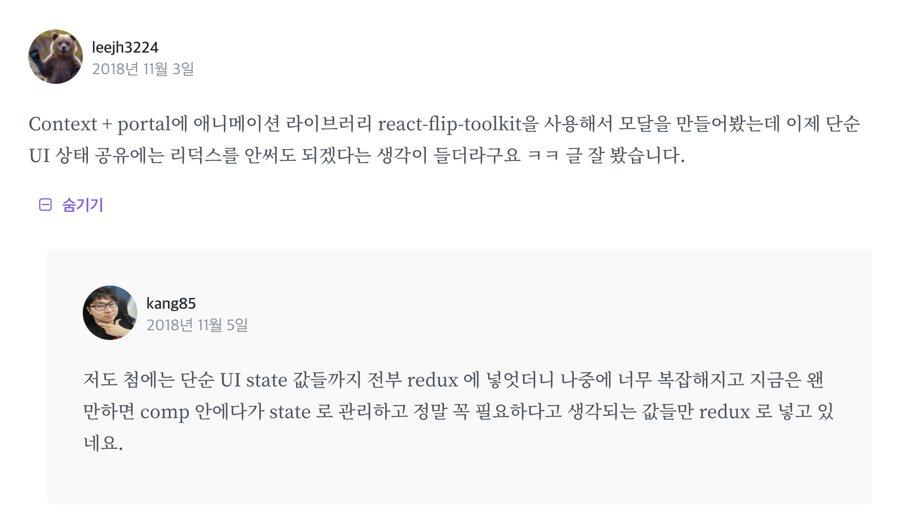

# Fragments <>

<!-- 프레그먼트 -->

`Fragment`를 사용하면 DOM에 별도 노드를 추가하지 않고 자식 목록을 그룹화 할 수 있습니다.

```js
render() {
  return (
    <React.Fragment>
      <ChildA />
      <ChildB />
      <ChildC />
    </React.Fragment>
  );
}

// 모든 유명한 도구에서 아직 지원하지 않는다고 합니다.
render() {
  return (
    <>
      <ChildA />
      <ChildB />
      <ChildC />
    </>
  );
}
```

## 동기

컴포넌트 분리를 하면서 HTML이 유효하지 못하는 경우에 사용 합니다.

[동기 예제 스크롤 20%](https://reactjs-org-ko.netlify.com/docs/fragments.html)

## 사용법

### <React.Fragment>

```js
class Columns extends React.Component {
  render() {
    return (
      <React.Fragment>
        <td>Hello</td>
        <td>World</td>
      </React.Fragment>
    );
  }
}
```

### 짧은 구문 <>

fragment를 선언하기 위해 빈 태그로 짧게 작성 할 수 있습니다.

```js
class Columns extends React.Component {
  render() {
    return (
      <>
        <td>Hello</td>
        <td>World</td>
      </>
    );
  }
}
```

- `<></>` 는 key나 속성을 지원하지 않는다.
- 많은 도구에서 아직 지원하지 않기 때문에 명시적으로 `<React.Fragment>` 작성 해야될 수 있습니다.
- 문법을 지원하는 바벨7입니다. 최신 버전

### Key가 있는 Fragment

```js
function Glossary(props) {
  return (
    <dl>
      {props.items.map(item => (
        // Without the `key`, React will fire a key warning
        <React.Fragment key={item.id}>
          <dt>{item.term}</dt>
          <dd>{item.description}</dd>
        </React.Fragment>
      ))}
    </dl>
  );
}
```

- `<React.Fragment>`구문을 사용해 Fragments를 선언합니다.
- `Key`는 `Fragments`에 전달 가능한 유일한 속성입니다.

# Context


React 어플리케이션에서 데이터는 props를 통해서 위에서 아래로 (부모 -> 자식) 전달됩니다. 하지만 `Context`를 사용하면 `props`을 통해 트리의 모든 부분에 직접 값을 넘겨주지 않고도, 값을 아래쪽으로 공유할수 있습니다.

> 나름 신생아 2018년 3월 30일에 배포가 되었데요.

redux, react-router, styled-components 등이 기존에 이 Context API 를 기반으로 구현이 되어있었습니다.

## Context를 언제 사용할까요?

- 애플리케이션으로 전역적으로 데이터가 사용되야 할 때 사용
- 로그인된 사용자의 정보, 테마, 언어 설정 등... 사용

## 전역 상태 관리

**최악의 구조**
프로젝트에서 전역적으로 사용 하려면 Redux, MobX 같은 라이브러리를 사용하지 않으면 아래와 같은 구조와 비슷하게 구현 해야합니다.


> Root 컴포넌트의 state 에는 value 라는 값이 있고, 이 값을 변경시키는 handleSetValue 라는 함수가 있다고 가정해봅시다. value 라는 값은 컴포넌트 F 와 J 에서 보여주고 있고, 이 값을 변화시키는 이벤트는 컴포넌트 G 에서 발생합니다.

1. value 값과 handleSetValue 함수를 props 로 하위 컴포넌트한테 전달
1. value 값은 Root => A =>B => F / Root => H => J
1. handleSetValue 값은 Root => A => B => E => G

   👉 **복잡 유지보수성 낮습니다. hell😵**

**전역 상태관리 적용**
Redux 나 MobX 같은 라이브러리 또는 `Context API`을 통하여 전역 상태관리를 할수 있어요


## [실습] 가즈아!!! 😋


- App 컴포넌트 내부에 LeftPane 과 RightPane 라는 컴포넌트를 만들고
- 한쪽에는 값을 설정시킬 Sends 컴포넌트, 그리고 반대쪽에는 Receives 컴포넌트를 넣어주겠습니다.
- App 에서부터 아래로 props 를 전달하는 것이 아닌, Context 를 통해서 바로 가져와서 사용해보겠습니다.

[실습 참고](https://velopert.com/3606)

---

**실습자료**

[Context](https://codesandbox.io/s/qz138z25q6)

[hoc](https://codesandbox.io/s/v5184zo0y)

[Context많을 경우](https://codesandbox.io/s/6v6pxvkwww)

[hoc 만드는 함수](https://codesandbox.io/s/3v78yz115q)

## API 정리

### React.createContext

`createContext`라는 함수를 호출하면 `Provider` 와 `Consumer` 라는 컴포넌트들이 반환

<!-- 프러바이더 -->

### Provider

`Provider` 는 `Context` 에서 사용 할 값을 설정할 때 사용

### Consumer

`Consumer` 는 나중에 우리가 설정한 값을 불러와야 할 때 사용

## Context API가 Redux를 대체할 수 있을까요?

[Context API가 Redux를 대체할 수 있을까요?](https://medium.com/@Dev_Bono/context-api%EA%B0%80-redux%EB%A5%BC-%EB%8C%80%EC%B2%B4%ED%95%A0-%EC%88%98-%EC%9E%88%EC%9D%84%EA%B9%8C%EC%9A%94-76a6209b369b)

# 3. Portals

<!-- 포털즈 -->


`portals`는 리액트 프로젝트에서 컴포넌트를 렌더링하게 될 때, UI를 어디에 렌더링 시킬지 DOM을 사전에 선택하여 부모 컴포넌트의 바깥에 렌더링 할 수 있게 해주는 기능

> React v16에서 도입된 기능입니다.

```js
ReactDOM.createPortal(child, container);
```

## 3.1. 사용예시

기존의 React에서 컴포넌트를 렌더링 하게 될 때, children은 부모컴포넌트의 DOM 내부에 렌더링 되어야 했습니다.

```js
render() {
  // React mounts a new div and renders the children into it
  return (
    <div>
      {this.props.children}
    </div>
  );
}
```

`Portals`를 사용하면 DOM의 계층구조 시스템에 종속되지 않으면서 컴포넌트를 렌더링 할수 있습니다. 즉, DOM 내의 다른 위치에 자식을 넣는것이 유효합니다.

```js
const MyPortal = ({ children }) => {
  const el = document.getElementById("my-portal");
  return ReactDOM.createPortal(children, el);
};
```


> `Portals`를 사용하면 root > App 내부가 아니라 그 바깥의 `<div id="modal"></div>` 안에 렌더링되었습니다.

## 3.2. 사용 사례

- 부모 컴포넌트가 `overflow: hidden`이나 `z-index` 스타일을 가지지만, 자식이 컨테이너에서 시각적으로 "이탈해야 하는 경우"
- 다이얼로그, 호버카드, 툴팁

[MyModal 만들기 실습](https://velog.io/@velopert/react-portals)

## 3.3 정리

렌더링을 원하는 DOM에 자유자재로 할 수 있습니다. 참고로 타켓DOM이 꼭 App 바깥이 아니여도 됩니다. 리액트 앱 내부에 다른곳에 렌더링 하고 싶을때도 동일한 방식입니다.



# 참고한 링크

[React DOCS context](https://reactjs-org-ko.netlify.com/docs/context.html)

[velopert Context](https://velopert.com/3606)

[React DOCS fragments](https://reactjs-org-ko.netlify.com/docs/fragments.html)

[velog Poetals](https://velog.io/@velopert/react-portals)

[React DOCS Portals ](https://reactjs-org-ko.netlify.com/docs/portals.html)
